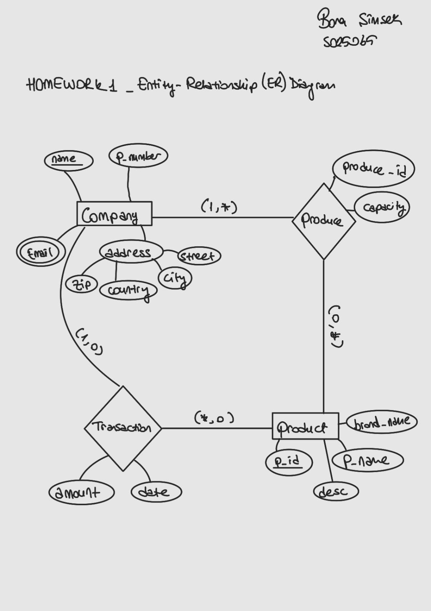

# Relations

-------------------
By looking to db-schema.sql file, we can see the relations between tables. Here is the list of relations between tables:

-------------------
Product (id, name, description, brandName)
    PRIMARY KEY (Product) = <id>
    name -> NOT NULL

City (zip, city)
    PRIMARY KEY (City) = <zip>

cEmail (cName, cEmail)
    PRIMARY KEY (cEmail) = <cName, cEmail>
    FOREIGN KEY cEmail (cName) REFERENCES Company (cName)

Company (cName, country, zip, street, cPhoneNumber)
    PRIMARY KEY (Company) = <cName>
    CANDIDATE KEY (Company) = <cPhoneNumber>
    FOREIGN KEY Company (zip) REFERENCES City (zip)
    cPhoneNumber -> NOT NULL

Porder (orderID, cName, pId, oAmount, oDate)
    PRIMARY KEY (Porder) = <orderID>
    FOREIGN KEY Porder (cName) REFERENCES Company (cName)
    FOREIGN KEY Porder (pID) REFERENCES Product (id)
    cName,pID -> NOT NULL

Produce (proId, cName, pID, capacity)
    PRIMARY KEY (Produce) = <proID>
    FOREIGN KEY Produce (cName) REFERENCES Company (cName)
    FOREIGN KEY Produce (pID) REFERENCES Product (id)
    cName, pID -> NOT NULL

-------------------
# ER Diagram

-------------------

-------------------